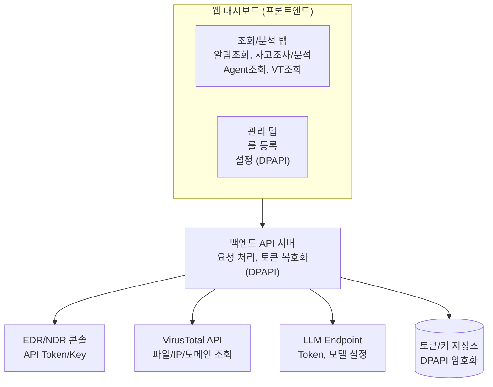

# EDR/NDR 웹 대시보드 아키텍처

```mermaid
flowchart TD
    subgraph FE["웹 대시보드 (프론트엔드)"]
        direction LR
        T1["조회/분석 탭<br/>알림조회, 사고조사/분석<br/>Agent조회, VT조회"]
        T2["관리 탭<br/>룰 등록<br/>설정 (DPAPI)"]
    end

    FE --> API["백엔드 API 서버<br/>요청 처리, 토큰 복호화(DPAPI)"]

    API --> EDR["EDR/NDR 콘솔<br/>API Token/Key"]
    API --> VT["VirusTotal API<br/>파일/IP/도메인 조회"]
    API --> LLM["LLM Endpoint<br/>Token, 모델 설정"]

    API --> STORE[("토큰/키 저장소<br/>DPAPI 암호화")]
```

</file_text>